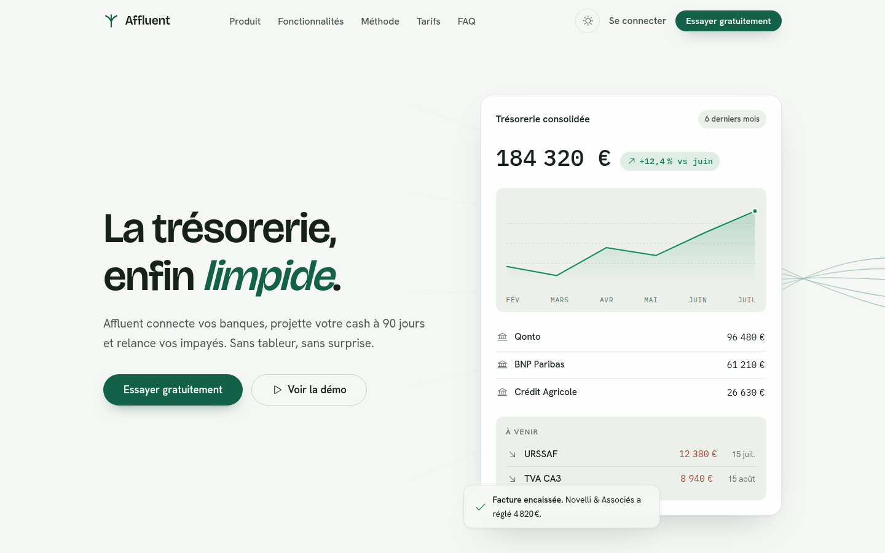

# Affluent · Landing SaaS

Landing page complète et fictive pour **Affluent**, un SaaS français de pilotage de
trésorerie pour PME : connexion bancaire, prévisionnel à 90 jours, relances
d'impayés, TVA et échéances.



## Ouvrir le site

Aucune dépendance, aucun build :

```bash
# au choix
open index.html
# ou, pour un rendu strictement identique à la prod (polices, images)
python3 -m http.server 8123   # puis http://localhost:8123
```

## Ce que contient la page

- **Hero** avec démo produit réelle : graphe de trésorerie SVG interactif
  (réticule + infobulle au survol), soldes par banque, échéances à venir.
- **Démo interactive à onglets** : prévisionnel avec trois scénarios qui
  re-tracent la courbe (bande d'incertitude, alerte de découvert), pipeline de
  relances, provisions de TVA en barres animées.
- **Bento** de cinq fonctionnalités (synchronisation, sécurité, multi-entités,
  alertes vivantes, expert-comptable).
- Méthode en trois étapes, témoignages, chiffres animés, **tarifs** avec bascule
  mensuel / annuel, FAQ en accordéon, CTA final, footer complet avec newsletter.

## Design

- **Thèmes clair et sombre** (`data-theme` + `prefers-color-scheme`, bascule
  persistée en `localStorage`).
- Palette : vert profond unique en accent ; couleurs de graphe validées
  contre les surfaces des deux thèmes (bande de luminance OKLCH, plancher de
  chroma, séparation daltonisme, contraste WCAG).
- Typographies auto-hébergées (latin, woff2) : Bricolage Grotesque (titres),
  Hanken Grotesk (texte), IBM Plex Mono (chiffres).
- Rayons : boutons et puces en pilule, cartes 20 px, tuiles et champs 12 px.
- Animations : révélation du titre ligne à ligne, tracé progressif des courbes,
  compteurs, marquee clients, parallaxe du CTA (scroll-driven, progressif),
  CTA magnétique, pile d'alertes qui tourne. Tout est désactivé proprement
  sous `prefers-reduced-motion`, et aucun écouteur `scroll` n'est utilisé
  (IntersectionObserver / ResizeObserver uniquement).

## Structure

```
index.html              Page unique (sprite d'icônes inline)
assets/css/fonts.css    @font-face auto-hébergées
assets/css/style.css    Système de design + composants
assets/js/app.js        Graphiques SVG, onglets, scénarios, compteurs, thème
assets/fonts/           woff2 (Google Fonts, licences OFL/Apache)
assets/img/             Photos (picsum.photos) : cascade CTA, cellule bento
```

## Crédits

- Icônes : [Phosphor Icons](https://phosphoricons.com) (MIT), inline en sprite.
- Photos de démonstration : [picsum.photos](https://picsum.photos).
- Polices : Google Fonts (Bricolage Grotesque, Hanken Grotesk, IBM Plex Mono).
- Marques clientes, personnes et chiffres : fictifs, à but de démonstration.
